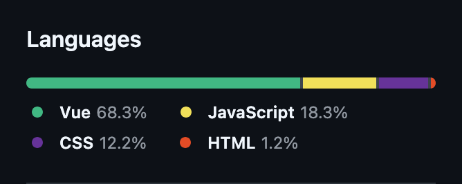

+++
title = "Small css and html win"
date = 2026-01-20
[taxonomies]
tags = ["code", "github"]
meta = ["short", "visual"]
threads = ["inkagu.co site"]
+++

Previous attempt at creating a personal website and the current one (from this sites [repo](https://github.com/bacv/inkagu-co)):

    
    

Feels simply nice.
