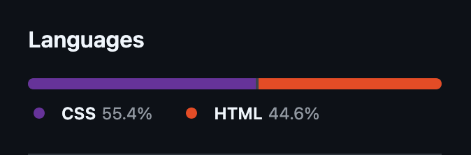

+++
title = "Small css and html win"
date = 2026-01-20
[taxonomies]
tags = ["code", "github"]
meta = ["short", "visual"]
ctx = ["first post"]
+++

Previous attempt at creating a personal website and the current one:

    
    

Feels simply nice.
