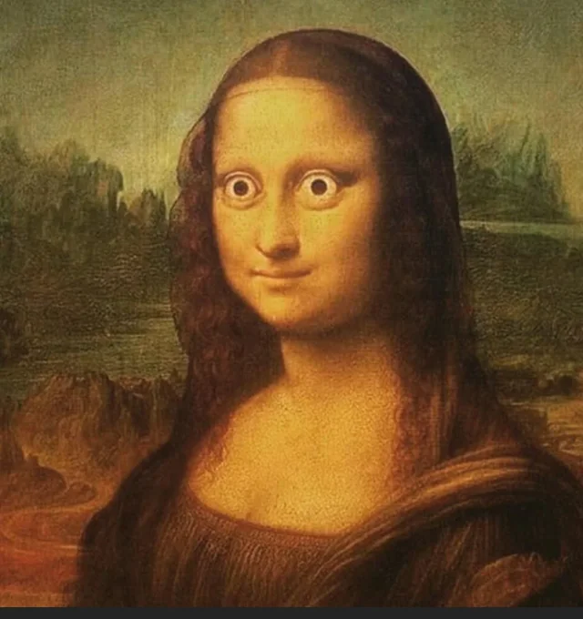

+++
title = "Site calibration: Image"
date = 2026-01-19
+++

Light and dark themes are now mostly done, one last thing is to see how to share images in such setup. This page is posted separately to see how zola handles assets inside the dedicated directory.

<p style="text-align: center;">
    
</p>

<!-- more -->

Not sure if I like this approach. The sizes might require manual work, thus in the end I feel like css per log is a way to go. For now I am leaving `img { max-width: 500px }` and html inside markdown.

This is how it looks inside the markdown document:
```html
<div style="text-align: center;">
    
</div>
```
